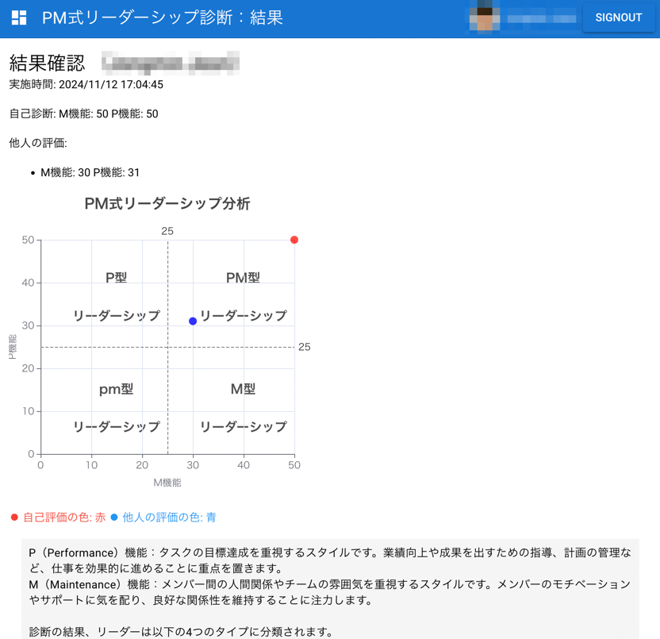

## PM式リーダーシップ診断
PM式リーダーシップ診断は、組織のリーダーシップの能力を判断するためのツールです。
- 本診断の設問は「新しいリーダーシップ―集団指導の行動科学 単行本 – 1966/8/1」から抜粋したものです。


Features
- Vue 3 + Vite
- quasar-template
- Firestore Database
- Firebase Authentication
- Firebase Hosting
- google auth

## 開発環境起動
```bash
npm run serve
```

## productionビルド
```bash
npm run build
```

## Firebaseへのデプロイ
```bash
firebase deploy
```

## .envファイルの設定
```bash
cp .env.example .env
```
```yaml
VITE_FIREBASE_API_KEY=
VITE_FIREBASE_AUTH_DOMAIN=
VITE_FIREBASE_PROJECT_ID=
VITE_FIREBASE_STORAGE_BUCKET=
VITE_FIREBASE_MESSAGING_SENDER_ID=
VITE_FIREBASE_APP_ID=
VITE_FIREBASE_MEASUREMENT_ID=

VITE_ALLOWED_DOMAIN="許可するドメイン"
```


